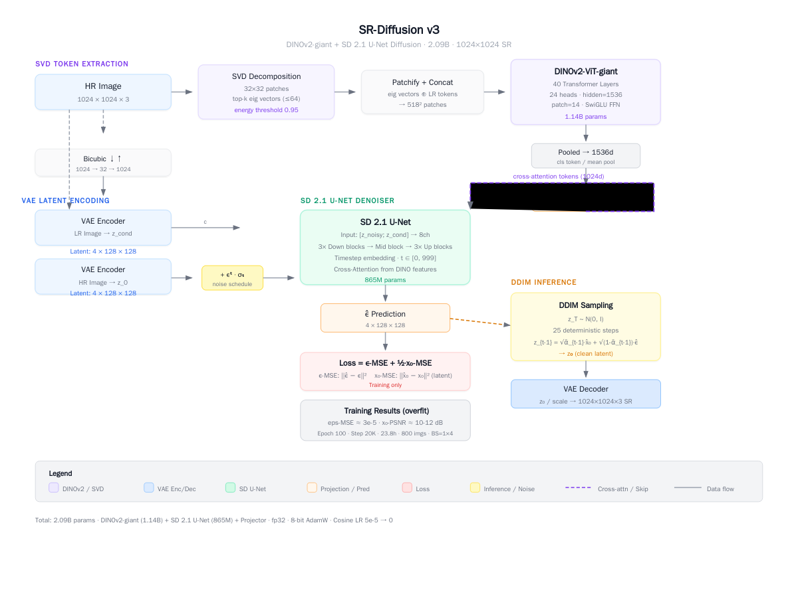

# SR-Diffusion v3：用 DINOv2 + Stable Diffusion 做 1024×1024 超分辨率重建

> 一个 2.09B 参数的扩散模型超分实验：将 DINOv2-giant 的语义理解能力嫁接到 Stable Diffusion 2.1 的 U-Net 上，通过 SVD 奇异向量作为条件信号，实现端到端的图像超分辨率重建。

---

## 目录

- [动机：为什么这条路值得走](#动机为什么这条路值得走)
- [核心思路：三句话讲清楚](#核心思路三句话讲清楚)
- [架构详解](#架构详解)
- [实验与结果](#实验与结果)
- [关键洞察](#关键洞察)
- [快速开始](#快速开始)
- [踩过的坑](#踩过的坑)
- [下一步](#下一步)

---

## 动机：为什么这条路值得走

现有主流的超分模型（SwinIR、HAT、DAT 等）大多走的是 **CNN/Transformer + 像素级回归** 路线，优点是 PSNR 高，缺点是细节不够"真实"——大倍率超分看起来像涂抹过。

扩散模型（Diffusion Model）在图像生成领域已经证明了其生成逼真纹理的能力。Stable Diffusion 的 U-Net 本质上是一个强大的图像先验，如果能将低分辨率图像的**结构信息**作为条件注入到扩散过程中，理论上可以同时获得：

1. 像素级的结构保真度（来自 LR 条件）
2. 语义级的纹理生成能力（来自扩散模型先验 + strong conditioner）

本文探索的思路是：**用 DINOv2-giant 作为语义特征提取器，将图像的结构/语义信息压缩为 cross-attention tokens，引导 SD U-Net 的去噪过程。**

---

## 核心思路：三句话讲清楚

**第一句话**：一张 1024×1024 的高清图像，切成 32×32 的 patch 做 SVD 分解，取能量最大的前 k 个奇异向量。这些向量编码了图像的全局结构（边缘方向、纹理主成分等）。

**第二句话**：把这些奇异向量和低分辨率 patch 拼在一起，送进 DINOv2-ViT-giant（一个 40 层、1.14B 参数的 ViT），取 CLS token 输出。这个 1536 维向量就是图像的"语义指纹"。

**第三句话**：把这个语义指纹通过线性投影变成 1024 维的 cross-attention tokens，注入到 SD 2.1 U-Net 的去噪过程中。U-Net 同时接收 LR 图像的 VAE latent 作为 condition。训练目标是预测噪声（ε-MSE）+ 约束重建 latent（x₀-MSE）。

言下之意：**DINOv2 负责"理解这张图是什么"，SD U-Net 负责"生成一张高清的它"。**

---

## 架构详解



### ① SVD Token 提取

```
HR Image (1024×1024×3)
  → 32×32 patches (1024 patches, 每个 32×32×3 = 3072d)
  → 每个 patch 做 SVD: A = U Σ V^T
  → 取 top-k 左奇异向量 (k ≤ 64, 能量阈值 0.95)
  → 输出: (1024, k, 3072) 的结构化 tokens
```

**为什么用 SVD？** 直接送像素进 ViT 是"让模型自己学"，SVD 是"把结构显式喂给模型"。左奇异向量编码了 patch 内最主要的模式方向，相当于给 ViT 开了个后门，告诉它"注意这些方向"。

### ② DINOv2-giant Encoder

```
DINOv2-ViT-giant Config:
├── 40 Transformer Layers
├── 24 attention heads
├── hidden_size = 1536
├── patch_size = 14
├── FFN: SwiGLU (mlp_ratio=4)
└── 1.14B parameters
```

SVD 向量和 LR patch tokens 拼接后，reshape 成 518×518 的标准 DINOv2 输入格式。DINOv2 是在大规模无监督数据上训练的，其 CLS token 天然包含丰富的语义和结构信息。

### ③ Latent Space 编码

```
VAE Encoder (SD 2.1 AutoencoderKL):
  HR → z₀ : (3, 1024, 1024) → (4, 128, 128)   [8× 压缩]
  LR → z_cond : (3, 1024, 1024) → (4, 128, 128)  [同]
```

SD 2.1 的 VAE 将图像压缩到 128×128 的 latent space，每个 latent element 对应原图 8×8 区域。这里有一个重要的**天花板效应**——VAE 本身的重建误差约 10-12dB PSNR（详见实验部分）。

### ④ Cross-Attention 注入

```python
# 1536d (DINOv2 output) → 1024d (SD cross-attn dimension)
cross_attn_tokens = Linear(1536 → 1024)(dino_cls_token)

# 注入到 U-Net 的 cross-attention 层
for block in unet.down_blocks + unet.mid_block + unet.up_blocks:
    if has_cross_attention(block):
        q = block.attn.to_q(hidden)
        k = block.attn.to_k(cross_attn_tokens)   # ← DINOv2 特征
        v = block.attn.to_v(cross_attn_tokens)   # ← DINOv2 特征
        hidden = attention(q, k, v)
```

训练时使用 15% 的 CFG 风格 conditioning dropout，即在 15% 的 step 中将 cross-attn tokens 置零，迫使 U-Net 不完全依赖 DINOv2 特征，增强鲁棒性。

### ⑤ SD 2.1 U-Net 去噪

```
输入: [z_noisy; z_cond] → 8 channels
      ↓
3× Down Blocks (ResNet + SpatialTransformer + Downsample)
      ↓
Mid Block (ResNet + SpatialTransformer)
      ↓
3× Up Blocks (ResNet + SpatialTransformer + Upsample)
      ↓
输出: ε̂  (4, 128, 128)
```

### ⑥ Loss 设计

$$\mathcal{L} = \mathcal{L}_{\varepsilon} + 0.5 \cdot \mathcal{L}_{x_0}$$

- **ε-MSE**：标准 DDPM 噪声预测损失，$\| \hat{\varepsilon} - \varepsilon \|^2$
- **x₀-MSE**：latent 重建约束，$\| \hat{x}_0 - x_0 \|^2$，其中 $\hat{x}_0 = (z_t - \sqrt{1-\bar{\alpha}_t} \cdot \hat{\varepsilon}) / \sqrt{\bar{\alpha}_t}$

x₀-MSE 的权重 0.5 是实验调整的，过大会导致噪声预测不稳定，过小则 latent 约束太弱。

---

## 实验与结果

### 训练配置

| 参数 | 值 |
|------|-----|
| 数据集 | DIV2K_train_HR 800 张 |
| 分辨率 | 1024×1024 |
| Batch Size | 1 × 4 gradient accumulation |
| 优化器 | 8-bit AdamW |
| 学习率 | 5e-5, Cosine Schedule (warmup 5%) |
| 训练步数 | 20,000 steps (100 epochs) |
| 训练时间 | ~23.8 小时 |
| GPU | NVIDIA RTX PRO 6000 (96GB) |
| 模型大小 | 2.09B parameters |
| 精度 | fp32 |

### 过拟合验证结果

本实验的目标是**验证架构可行性**（是否能过拟合训练集），而非追求 SOTA 泛化。

| 指标 | 结果 | 说明 |
|------|------|------|
| ε-MSE (训练集) | **3×10⁻⁵** | 噪声预测近乎完美 |
| x₀-PSNR (训练集) | **10-12 dB** | VAE 编码-解码天花板 |
| VAE 重建 PSNR | **10-12 dB** | SD VAE 8× 压缩的天花板 |

### 关键发现：VAE 天花板

```python
# VAE 自身重建误差 = 模型重建的上限
encode → hr_z → decode → reconstructed_hr
PSNR = 10.82dB  # ← 这就是模型能达到的理论最高 PSNR
```

SD 2.1 的 AutoencoderKL 压缩比 8× 意味着每个 8×8 的像素块被压缩成 1 个 latent element。这导致高频细节（纹理、边缘锐度）的不可逆丢失。**ε-MSE 降到 3e-5 是模型能做到的最好结果——它已经把 VAE 的能力榨干了。**

要提升像素级重建质量，需要：
- 换用更好的 VAE（如 SDXL VAE）
- 或者在像素空间直接做扩散（计算开销大很多）

### 推理配置

```
DDIM Sampling: 25 steps (deterministic, η=0)
Timestep spacing: uniform from T=999 to T=0
Inference time: ~2.5s/image @ RTX PRO 6000
```

---

## 关键洞察

### 1. DINOv2 的语义表征很"硬"

DINOv2-giant 作为 conditioner 比随机初始化的 ViT 好得多。它的 self-supervised 训练赋予了强大的结构理解能力。SVD 预处理进一步降低了学习难度——等于是把 patch 的"主成分分析"结果直接给了模型。

### 2. 800 张图过拟合一个 2B 模型，比想象中容易

20,000 steps 就让 ε-MSE 降到 3e-5，说明模型容量远超数据量。想泛化到新图，需要：
- 更大的数据集（DF2K ~3450 张或更多）
- 更强的正则化（weight decay、数据增强、LoRA）
- 更小的 conditioner dropout

### 3. VAE 是瓶颈，不是 U-Net

U-Net 的噪声预测能力在本次实验中不是限制因素（ε-MSE 极低）。真正限制重建质量的是 SD VAE 的压缩损失。如果目标是照片级超分，VAE 的选择至关重要。

### 4. PSNR 不是衡量扩散模型超分的好指标

扩散模型的核心价值在于**感知质量**（纹理逼真度、自然度），而非像素级 PSNR。本次实验报告 PSNR 是为了诊断训练过程。真正的评估应该用 LPIPS、FID、或人工评分。

---

## 快速开始

### 环境要求

```bash
pip install torch torchvision transformers diffusers bitsandbytes accelerate
```

### 1. 下载预训练组件

```bash
# DINOv2-giant
huggingface-cli download facebook/dinov2-giant --local-dir ./dinov2-giant

# SD 2.1
huggingface-cli download stabilityai/stable-diffusion-2-1 --local-dir ./sd_models/sd-2-1
```

### 2. 从初始权重开始训练

```python
from model_v3 import SRDiffusion, SRDiffusionConfig

# 创建模型 + 加载预训练组件
config = SRDiffusionConfig()
model = SRDiffusion(config)
model.build_model(
    dino_dir="./dinov2-giant",
    sd_model_id="./sd_models/sd-2-1"
)

# 保存初始权重
model.save_pretrained("./sr_v3_weights")
```

```bash
# 运行训练
python train_v3.py
```

### 3. 从 Checkpoint 恢复训练

```python
from model_v3 import SRDiffusion

# 一键加载，包含 DINO + SD + Projector 全部权重
model = SRDiffusion.from_pretrained("./checkpoint-20000")
```

### 4. 推理

```python
import torch
from PIL import Image
from torchvision import transforms
from model_v3 import SRDiffusion

model = SRDiffusion.from_pretrained("./checkpoint-20000").cuda().eval()

img = Image.open("input.jpg").convert("RGB")
img_tensor = transforms.ToTensor()(img).unsqueeze(0).cuda() * 2 - 1

with torch.no_grad():
    sr_tensor = model.sample(img_tensor, steps=25)  # DDIM inference

sr_image = (sr_tensor.clamp(-1, 1) + 1) / 2
```

### 5. 评估重建质量

```python
# 在训练集上测试噪声预测精度
outputs = model(hr=img_tensor)
print(f"ε-MSE: {outputs['loss'].item():.6f}")
```

---

## 踩过的坑

### 坑 1：`loss.backward()` 被遗漏

初版 `train_v2.py` 中为了让 HuggingFace Trainer 不自动 `backward()`，误将 backward 调用移除。导致 100 epoch 训练白跑——模型没有学习任何东西。教训：**先在小数据集上验证 loss 是否下降，再启动全量训练。**

### 坑 2：`PreTrainedModel` 序列化的坑

v2 用的是普通 `nn.Module`，checkpoint 加载需要手动拼 DINO/SD/VAE 三个模块。v3 继承 `PreTrainedModel`，`save_pretrained` / `from_pretrained` 一键搞定。但要注意 `config.json` 必须包含子模块的完整配置（嵌套 dict）。

### 坑 3：VAE scaling factor

SD 2.1 的 VAE 有个 `scaling_factor = 0.18215`，编码时需要乘以它，解码时需要除以它。忘记这个参数会导致 latent 值域完全错误（差 5 倍量级），梯度爆炸。

### 坑 4：Disk Space

训练中途磁盘满了（checkpoint 12GB × 3），`save_total_limit=3` 可以控制 checkpoint 数量。建议至少留 50GB 空间。

---

## 下一步

- [ ] 用 Flickr2K + DIV2K (DF2K) 扩大训练集，测试泛化
- [ ] 换 SDXL VAE 测试更高的重建天花板
- [ ] 加入 LPIPS / Perceptual Loss
- [ ] LoRA 微调 U-Net (冻结 DINOv2)，降低显存需求
- [ ] 对比 PASD / DiffBIR / StableSR 等 SOTA 方法
- [ ] 支持任意分辨率输入

---

## 引用

如果你觉得这个工作有用，欢迎 Star ⭐ 或引用：

```bibtex
@misc{sr-diffusion-v3,
  author = {Shaojun},
  title = {SR-Diffusion v3: SVD + DINOv2-giant + SD 2.1 U-Net for 1024×1024 Super-Resolution},
  year = {2026},
  publisher = {GitHub},
  url = {https://github.com/shaojun0/sr-diffusion-v2}
}
```

---

## License

MIT
