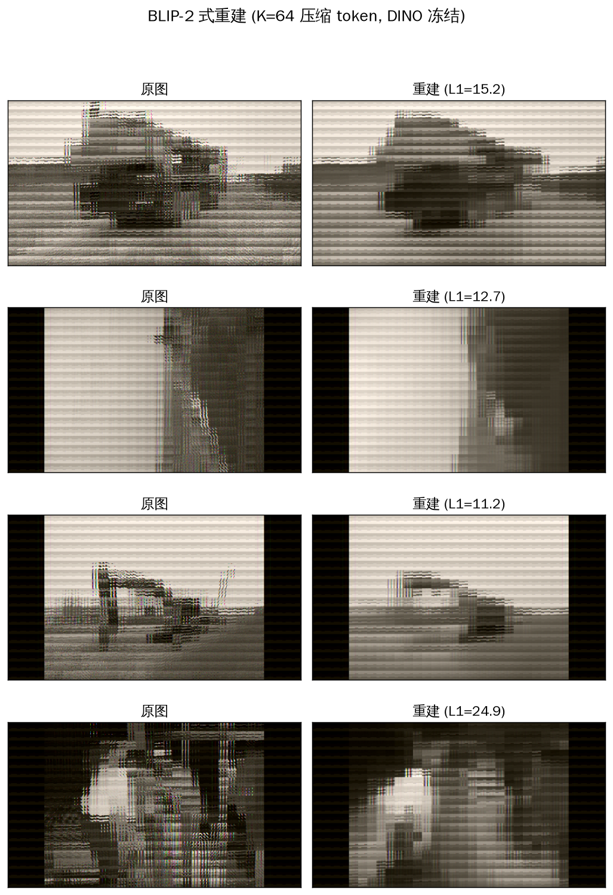

# SR-Diffusion v3 — BLIP-2 式 K 压缩实验报告（2026-08-28）

> 服务器: 2× RTX PRO 6000 (97GB) ｜ 分支: `main` ｜ 设计: `doc/2026-08-28/DESIGN_blip2_v3.md`
> 目的: 前几轮（特征目标→像素目标→register_specials）效果始终不理想，用户拍板
> "完全按 BLIP-2 来，先简单"——用 **K=64 固定压缩** 做一步简单实验定位瓶颈。

---

## 1. 架构（BLIP-2 式最小版）

```
pixel_values (B,3,448,252)
  → DINOv2-large（默认冻结, no_grad）→ feats (B,257,1024)
  → QFormer: K=64 可学习 query, 自注意力+交叉注意力读 feats → z_s (B,64,1024)
  → OutputQueryDecoder: N=576 查询行（行 k↔patch k）交叉注意力读 64 键 → (B,576,1024)
  → PixelHead（2 层 MLP 1024→2048→588）→ 像素 (B,576,588)
  → L = L1(pixels, target)（平权）
```

无 ReEncoder / 无 SpecialTokenBank / 无采样步 / 无渐进曲线。可训练参数 62.7M（DINO 冻结）。

## 2. 训练

- 40 epochs / 8760 步（~219 步/epoch）, 2 GPU DDP, bs=16/卡, lr=3e-4 cosine, 全 fp32
- 28 分钟完成（DINO 冻结只前向不反传, 比 v2 快 ~2×）
- eval_loss: 0.509（冒烟 500 步）→ 0.350（epoch 9）→ 0.322（epoch 18）→ 0.310（epoch 27）→ **0.3097（epoch 40）**，单调下降无回升 = 未过拟合
- 产物: `output/phase1_v3_blip2/final_model.pt`（1.47GB fp32）+ 5 个 checkpoint

## 3. 推理结果（全量 3004 张 test, fp32）

| 指标 | 数值 | 参照 |
|---|---|---|
| 全量重建像素 L1 (归一化) | **0.3096** | — |
| 全量重建像素 L1 (0-255) | **17.77 ± 6.45** | v2=23.41 / 平均色≈61 / DINO 线性上限≈9.8 |

**BLIP-2 式 v3 是当前最优**：17.77 vs v2 23.41，改善 **24%**，接近 DESIGN 目标 ≤16。

## 4. 瓶颈定位（双线性探针, 128 条 test）

| 探针 | L1 (0-255) | 解读 |
|---|---|---|
| z_s 均值 → 线性解码 | 60.83 | 压缩表示的**均值**无像素信息（预期: 64 token 各编码不同内容; within-std=0.97 证实 token 间差异大） |
| **解码器输出 h → 线性解码** | **17.03** | **≈ 全量重建 17.77** → QFormer→解码器→h 链路信息充分 |
| DINO 原始特征 → 线性解码（历史） | 9.8 | 冻结 DINO 的信息上限 |

### 结论

1. **解码链路不是瓶颈**：h 线性解码 17.03 ≈ 全量重建 17.77，说明 QFormer 压缩表示→解码器→h 已经把信息读出，PixelHead 也没有丢信息（线性解码都能到 17）。
2. **瓶颈在压缩表示的信息损失**：与 DINO 原始特征上限 9.8 的差距 ≈7.2，来自 **K=64 压缩本身**（QFormer 把 576 patch 压进 64 token 有损）+ **冻结 DINO 的适配限制**。
3. **前几轮"效果不行"的归因**：v2 各变体的瓶颈都在解码器侧路由（DIAGNOSIS F3/F4，L1 停在 22-24）；v3 换 BLIP-2 结构后解码链路通了（17.03），**剩余差距是压缩率本身的代价**——这正好是 Phase 1 中间验收（K 压缩 × 重建质量）要测的量。

## 5. 下一步（按判据）

- **若目标 ≤16**：压缩代价 7.2 需削减 → ① 增大 K（K=128/256，`--num_queries`）看 9.8→13 是否可达；② 解冻 DINO（`--train_dino`，让编码器适配像素重建）——两开关都已在 `train_v3.py` 就绪，可直接跑。
- **若目标=9.8 附近**：那是冻结 DINO 的信息上限，需 K 更大或 DINO 适配。
- K 压缩探针现在能跑了（修复了 K≠N 维度 bug），后续每个 K/冻结组合都跑 `infer_v3.py` 对比。

## 6. 修复记录

- `infer_v3.py` K 压缩探针原实现把 z_s (M,K,D) 展平 M·K 行与像素 M·N 行做 lstsq —— K=64≠N=576 维度不匹配崩溃。改为 **z_s 均值池化口径**（均值复制 N 份逐 patch 对齐），并新增 **解码器 h 逐 patch 线性探针**（h 是逐 patch 的, 可直接对齐）——后者才是定位解码链路的关键指标。commit `7e1c40a`。

## 7. 复现

```bash
# 训练
accelerate launch --multi_gpu --num_processes 2 train_v3.py \
    --data_dir /root/autodl-tmp/construction_site \
    --dino_dir /root/autodl-tmp/models/dinov2-large \
    --output_dir output/phase1_v3_blip2 --epochs 40

# 推理（全量 L1 + K 压缩双探针）
python infer_v3.py --data_dir ... --dino_dir ... \
    --final_model output/phase1_v3_blip2/final_model.pt \
    --output output/phase1_v3_blip2/infer_test.json --probe_limit 128

# 可视化
python visualize_v3.py --data_dir ... --dino_dir ... \
    --final_model output/phase1_v3_blip2/final_model.pt \
    --out output/phase1_v3_blip2/recon_visual.png
```

产物在服务器 `/root/autodl-tmp/sr-diffusion-v3-main/output/phase1_v3_blip2/`。

## 8. 重建可视化



（原图 vs 重建蒙太奇，4 张 test 样本；单次前向无采样步。）

