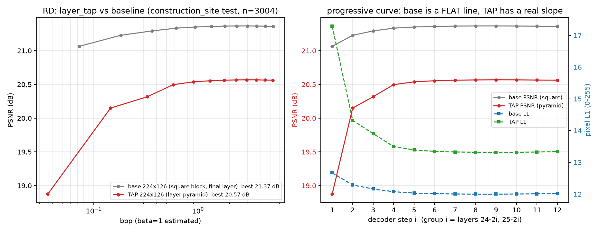

> ⚠️ **2026-09-23 归档说明**: 本文记录的「逐层 tap / 特征金字塔」已**整块从 `main` 移除**（用户口径: main 只保留主线目标, 实验性分支不进主线）。本文只作历史存档; 相关代码与脚本（`model_v2.py` / `train_v2.py` / `infer_v2_test.py` / `tools/*_tap*`）已删除, 要复现请 `git checkout` 2026-09-22 当时的 commit。

# REPORT — DINOv2 逐层 tap（金字塔读出）实测: 绝对质量输 0.80 dB, 但曲线从「平线」变成真有斜率（2026-09-22）

> 设计/口径：[`DESIGN_layer_tap_pyramid.md`](DESIGN_layer_tap_pyramid.md)（用户四问四答定稿）
> 代码：`git b17c371`（`--layer_tap`，默认关）｜启动脚本 `tools/run_224_d4_bptt_tap.sh`
> 数据：`construction_site` test **3,004** / train 7,009；输入 224×126（patches 16×9=144）；
> 对照臂 = `out_224_d4_bptt`（**同代码、同数据、同 8,760 步、同 seed，唯一差别 = 读窗口口径**）

---

## 0. 一句话

**"把浅层接回来"没有提高画质，反而全网变差 0.80 dB —— 但它把曲线形状彻底改了。**

| 判据 | 基线（平方块 / 末层） | **tap（逐层金字塔）** | 结论 |
|---|---|---|---|
| 像素 L1 (0-255) | **12.02 ± 4.50** | 13.34 ± 4.85 | **输 +1.32 px** |
| 最优 PSNR（t=81） | **21.37 dB** | 20.57 dB | **输 −0.80 dB** |
| 最优 MS-SSIM | **0.7731** | 0.7097 | 输 −0.063 |
| 曲线跨度（PSNR） | 0.30 dB | **1.69 dB** | **赢 5.6×** |
| 首步↔末步逐图相关 | 0.9979 | **0.9623** | **赢**（曲线不再只是整体平移） |
| 逐图自适应天花板 | +0.042 dB | **+0.269 dB** | **赢 6×**（但仍不够当主贡献） |

⇒ **"曲线平"的一部分原因确实是"所有向量都来自同一层"**（tap 让它有斜率了）；
但**代价是画质**，且自适应早停仍不成立（天花板 0.27 dB）。
这同时**反驳**了"平线 = 缺浅层纹理 tap"的简单解释：补上浅层 tap，画质没有变好。

---

## 1. 实验设置（单变量对照）

| 项 | 基线 `out_224_d4_bptt` | **tap `out_224_d4_bptt_tap`** |
|---|---|---|
| 读窗口 | 平方块 `z_s[k²:(k+1)²−1]`（首步含 `z_cls`），**全部来自末层** | **逐层金字塔** `z_s[(i−1)²:i²]`（不读 `z_cls`），第 i 组来自第 `24−2i, 25−2i` 层 |
| 每步向量数 | 4,5,7,…,23,**1**（K=144 截断末块） | **1,3,5,…,23**（无缝覆盖、无重叠） |
| K / 步集 / N | 144 / `[1,4,…,144]` / 144 | 同 |
| 解码器 / carry / 损失 | d4 / **BPTT** / `mean_t L1(PixelHead(Y_t),·)` | 同 |
| 训练 | 40 epoch = 8,760 步，2×bs16，lr 1.5e-4，seed 42 | 同 |
| 实测 | 2.38 it/s，64 min，26.6 GB/卡 | **2.68 it/s，58 min，23.3 GB/卡** |
| 权重 | — | `final_model.pt` md5 `ee71a0d5b5f73a605f96988de9f7cc4e` |

两侧**不新增任何参数**（518 keys / 375,302,732 参数逐 key 逐形状相同）⇒ 对照是干净的
"向量来自哪一层"，**不是** token 预算差异。

---

## 2. 主结果：逐 step 全表（test 3,004）

| t | base tok | base bpp | tap tok | tap bpp | base L1 | tap L1 | base PSNR | tap PSNR | base MS-SSIM | tap MS-SSIM | base PSNR内容 | tap PSNR内容 |
|---|---|---|---|---|---|---|---|---|---|---|---|---|
| 1 | 2 | 0.073 | 1 | 0.036 | **12.670** | 17.293 | **21.06** | 18.87 | **0.7466** | 0.5404 | **19.97** | 17.78 |
| 4 | 5 | 0.181 | 4 | 0.145 | **12.289** | 14.321 | **21.23** | 20.15 | **0.7609** | 0.6780 | **20.13** | 19.06 |
| 9 | 10 | 0.363 | 9 | 0.327 | **12.164** | 13.905 | **21.29** | 20.32 | **0.7671** | 0.6934 | **20.20** | 19.23 |
| 16 | 17 | 0.617 | 16 | 0.580 | **12.076** | 13.497 | **21.33** | 20.50 | **0.7697** | 0.7041 | **20.24** | 19.41 |
| 25 | 26 | 0.943 | 25 | 0.907 | **12.033** | 13.390 | **21.35** | 20.54 | **0.7713** | 0.7072 | **20.26** | 19.45 |
| 36 | 37 | 1.342 | 36 | 1.306 | **12.014** | 13.347 | **21.36** | 20.55 | **0.7723** | 0.7086 | **20.27** | 19.46 |
| 49 | 50 | 1.814 | 49 | 1.778 | **12.004** | 13.326 | **21.36** | 20.56 | **0.7727** | 0.7093 | **20.27** | 19.47 |
| 64 | 65 | 2.358 | 64 | 2.322 | **12.000** | 13.318 | **21.37** | 20.57 | **0.7730** | 0.7095 | **20.27** | 19.48 |
| 81 | 82 | 2.975 | 81 | 2.939 | **12.000** | 13.316 | **21.37** | 20.57 | **0.7731** | 0.7097 | **20.27** | 19.48 |
| 100 | 101 | 3.664 | 100 | 3.628 | **12.004** | 13.317 | **21.37** | 20.57 | **0.7731** | 0.7097 | **20.27** | 19.48 |
| 121 | 122 | 4.426 | 121 | 4.390 | **12.010** | 13.325 | **21.36** | 20.57 | **0.7729** | 0.7096 | **20.27** | 19.47 |
| 144 | 145 | 5.261 | 144 | 5.224 | **12.020** | 13.339 | **21.36** | 20.56 | **0.7728** | 0.7092 | **20.27** | 19.47 |

**tap 在每一个 t 上都输**（全画布、内容区、PSNR、MS-SSIM 一致）。
差距在 **t=1 最大（−2.19 dB）**，随 t 收窄到 **−0.80 dB**（t=144）。
MS-SSIM 的差距（−0.063）比 PSNR 更大 ⇒ 感知/结构质量退得比 PSNR 更多。

> ⚠️ 计数口径：tap 的 `step_tokens = t`（真实读入数，不读 `z_cls`），基线沿用历史
> `t+1`（首步另读 `z_cls`，实际 A 窗口是 4 个位置）。**在同等或更少的向量下，基线都更好**，
> 故结论不依赖这个口径。

## 2b. 不是"没训够"：eval_recon 轨迹全程落后且已收敛

| 步 | 2,000 | 4,000 | 6,000 | 8,000 | 8,760 |
|---|---|---|---|---|---|
| 基线 | 0.3603 | 0.2703 | 0.2261 | 0.2097 | **0.2091** |
| tap | 0.4218 | 0.3200 | 0.2526 | 0.2327 | **0.2321** |

比例稳定在 ~1.11×，两侧在 8,000→8,760 都基本不动 ⇒ 差距是**结构性的**，不是欠训练。
过拟合口径也一致（train1k − test）：基线 −0.45，tap −0.43。

---

## 3. 但曲线形状变了（本节是本轮最有价值的发现）



| 量 | 基线 | tap | 读法 |
|---|---|---|---|
| PSNR 跨度 | 0.30 dB | **1.69 dB** | 5.6×；"嵌套码质量阶梯"真的出现了 |
| L1 跨度 | 0.670 px | **3.977 px** | 同上 |
| 止损（单调前缀 / 最优 t / 跑满过冲） | 9/12 / t=81 / +0.020 px | 9/12 / t=81 / +0.023 px | 同 |
| 首步↔末步 **逐图 L1 相关** | 0.9979 | **0.9623** | 基线"早停=整体平移"，tap 不再如此 |
| Oracle 凸包天花板 ΔPSNR | +0.042 dB | **+0.269 dB** | 自适应空间 6× |
| E4b 实际最好 ΔPSNR | ≤ +0.01 dB | **+0.03 dB**（ε=0.03，停步覆盖 4/12） | 仍 **不成立** |

**读法**：
1. 基线的 12 步曲线是**一条平线**（12.67 → 12.02 px，72× 码率换 +0.30 dB）——
   这就是仓库反复记录的"没有渐进能力"。
2. tap 把**深度多样化**引进来后，曲线有了真实斜率（17.29 → 13.32 px）：
   **"平线"确实与"所有向量同层"有关**。
3. 但**斜率是靠抬高左端换来的**（早步变差），不是靠压低右端 ⇒ 绝对质量下降。
4. 自适应早停（C2b）**仍然不成立**：天花板只有 +0.269 dB，且实际 ε 判据最好 +0.03 dB。
   虽然比基线的 +0.042 大 6 倍，但离"能当论文主贡献"还差一个量级。

---

## 4. 机制解读（为什么补浅层反而更差）

1. **"向量"是 register，不是 patch**。第 g 组那 `2g−1` 个 register 是"共享 token + 逐位置 pos"，
   只经过 **2g 层**全局注意力。底部那 23 个（只走 2 层）里装的**不是**patch 高频，
   而是**"几乎没被语义化的全局摘要"** —— 所以我们**没有真的把浅层纹理接进解码器**，
   只是把"更弱处理过的全局向量"换给了后几步。这是本轮最可能的解释。
2. **末步（交付的 `F_hat`）吃的是最浅一组**。tap 第 12 步的 memory = 只走 2 层的 23 个 register；
   基线第 12 步的 memory = **1 个走满 24 层的 register**。后者 PSNR 反而高 0.80 dB
   ⇒ "一个深层全局向量" > "23 个浅层向量"（在这个分辨率/像素目标下）。
3. **与仓库既有诊断一致**：[`ANALYSIS_texture_vs_decoder_routing.md`](ANALYSIS_texture_vs_decoder_routing.md)
   §2 把第一根因判给**解码器的逐 patch 信息路由缺陷**（P1-1/P1-2，至今未做），
   把"特征里的信息还没被读出来"排在"要不要 tap 浅层"之前。本轮实测**支持这个排序**：
   在路由没修之前，换向量来源不解决天花板，只改变曲线形状。
4. **BPTT 不是瓶颈**：两臂都是 BPTT（`carry_detach=False`），
   且 [`REPORT_crossattn_encoder_grad.md`](REPORT_crossattn_encoder_grad.md) 已证明
   BPTT 把编码器通道**加宽** ×5（探针）/×9.5（扇出），不是变弱。

---

## 5. 诚实的边界

1. **单分辨率、单数据、单 seed、8,760 步**（构造性对照，不是收敛点充分搜索）。
2. 只测了**一种深度分配**（顶 1 → 底 23）。没测"反向分配"（顶 23 → 底 1）、
   "均匀分配"、或"只 tap 少数几个深度"。**"深浅分工不成立"这个更强的结论本轮不能下**——
   只能说"这一种分配在这套配置下输 0.80 dB，但把曲线做斜了"。
3. **bpp 是 β=1 估计**（`(t+tok_off)·D/(H·W)`），未量化/熵编码；两臂口径各自写进 json。
4. **没有动解码器路由**（P1-1/P1-2）⇒ 本轮不是对"浅层纹理假设"的终审，
   而是"在路由不变的前提下单独改向量来源"的干净单变量结论。
5. 224×126 的 padding 占 22.4%，全画布 L1 被 padding 稀释；内容区口径同表给出（结论相同）。

---

## 6. 下一步（按性价比）

| | 做法 | 理由 |
|---|---|---|
| ✅ 1 | **tap 的位置改为 patch token（该深度的 patch 特征）**，而不是 register | 直击 §4.1：现在"浅层"里根本没有高频；这是把"接浅层纹理"真正做实的最小改动 |
| ✅ 2 | **只 tap 2–4 个深度 + 与末层 z_s 拼接**（而不是把 K 全切碎） | 保留"深层全局向量"给末步（§4.2 已证明它更强），浅层只当补充 |
| ✅ 3 | **P1-1 逐 patch 内容查询**（`Q = W_q(A_t) + query_base + q_patch(z_s[k])`） | 仓库诊断里排名更高的那根杠杆，与 tap 正交 |
| ⚠️ 4 | 反向/均匀深度分配消融 | 便宜（8,760 步 ≈1 h），但预期收益低于 1–3 |
| ⛔ 5 | 把 tap 的"曲线变斜"当论文卖点 | 自适应天花板仅 +0.27 dB，且靠牺牲绝对画质换取 ⇒ 只能当 analysis/ablation 一节 |

---

## 7. 产物与复跑

| 产物 | 位置 |
|---|---|
| 代码（`--layer_tap`） | `git b17c371`；本报告 + `tools/compare_layer_tap.py` |
| 权重 | 服务器 `/root/autodl-tmp/construction_site/out_224_d4_bptt_tap/final_model.pt`（md5 `ee71a0d5…`） |
| 训练日志 | `/root/train_logs/tap_224_d4_bptt.log`（58 min, 2.68 it/s） |
| 评测日志 | `/root/train_logs/tap_eval_watcher.log` + 本目录 `data/test_tap_224_d4_bptt.log` |
| 逐图逐 step 原始 json（6.7 MB） | 服务器 `/root/autodl-tmp/cot_l1/eval_224_d4_tap/test_224_d4_bptt_tap.json` |
| 派生: RD/早停 json + 图 | [`data/rd_224_d4_tap.json`](data/rd_224_d4_tap.json) / [`data/rd_224_d4_tap.png`](data/rd_224_d4_tap.png) |
| 对照图 | [`data/curves_tap_vs_base.png`](data/curves_tap_vs_base.png)（逐 step 形状）/ [`data/rd_224_tap_vs_base.png`](data/rd_224_tap_vs_base.png)（bpp-PSNR + 传统 codec） |
| 对照表 | [`data/COMPARE_tap_vs_base.md`](data/COMPARE_tap_vs_base.md) |
| 基线（对照臂） | 服务器 `/root/autodl-tmp/cot_l1/eval_224_d4/`（同配方、平方块/末层） |

```bash
# 复跑训练（服务器）
cd /root/autodl-tmp/sr-diffusion-v3-tap && NUM_GPUS=2 bash tools/run_224_d4_bptt_tap.sh
# 复跑对照表/图
python tools/compare_layer_tap.py --plot curves_tap_vs_base.png
python tools/analyze_rd_earlystop.py <test_*.json> --plot rd.png --save-json rd.json
```
