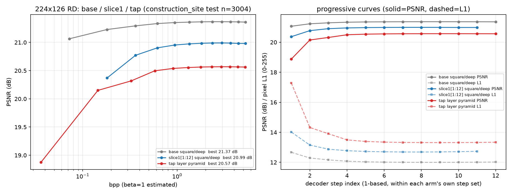

# REPORT — 224×126/d4/BPTT：把步集切片从 `[0:12]` 改成 `[1:12]`（去掉 t=1）实测（2026-09-22 晚）

> 用户口径：「跑 batch0 §10 那个实验（224×126 / d4 / BPTT / 工地 7,000 条 / 带训练集抽样评测），
> 只不过把本来是 step=0~12 现在改成 1~12」。
> 代码：`5a65eeb`（**零代码改动**，切片是既有 CLI 参数）｜脚本 `tools/run_224_d4_bptt_slice1.sh`
> 对照臂：`out_224_d4_bptt`（`[0:12]`，12 步）——**同代码/同数据/同步数/同 seed，唯一差别 = 切片**

---

## 0. 一句话

**去掉最便宜的那一步（t=1）不是"省一步"，而是抽掉整条 BPTT 草稿链的第一稿：**
整体 **−0.38 dB**（12.74 vs 12.02 px），而且**后续每个 t 都一起变差**
——注意 t≥9 的读窗口与基线**逐位相同**，差别只在下游 carry 历史。

同时它**丢掉了整条 RD 曲线最左端的操作点**（基线 `t=1` = 2 token / **0.073 bpp / 21.06 dB**；
本臂最左只能到 5 token / 0.181 bpp / 20.37 dB）⇒ 对"极低码率独占区"这条叙事是**净损失**。

| 臂 | 步数 | 像素 L1 (0-255) | 最优 PSNR (t=81) | 最优 MS-SSIM | PSNR 跨度 | 最左操作点 |
|---|---|---|---|---|---|---|
| **base `[0:12]`** | 12 | **12.02 ± 4.50** | **21.37** | **0.7731** | 0.30 dB | **2 tok / 0.073 bpp / 21.06 dB** |
| **slice1 `[1:12]`** | **11** | 12.74 ± 4.61 | 20.99 | 0.7356 | 0.62 dB | 5 tok / 0.181 bpp / 20.37 dB |
| （参考）tap 逐层金字塔 | 12 | 13.34 ± 4.85 | 20.57 | 0.7097 | 1.69 dB | 1 tok / 0.036 bpp / 18.87 dB |



---

## 1. 这一刀到底切了什么（已逐位核对）

| | base `[0:12]` | **slice1 `[1:12]`** |
|---|---|---|
| 采样步 t | 1, 4, 9, 16, 25, 36, 49, 64, 81, 100, 121, 144 | **4, 9, 16, …, 144**（11 步） |
| 首步窗口 | `A[0:3]`（z_cls + 3 个 register, 4 位） | **`A[0:8]`（z_cls + 8 个 register, 9 位）** |
| t≥9 的窗口 | `A[9:16], A[16:25], …` | **完全相同** |
| K / N | 144 / 144 | 144 / 144（K 不变） |
| 覆盖 | A[0..144] 全被读到 | A[0..144] 全被读到（**无花瓶 register**） |

⇒ 唯一实质变化 = **把原来的 t=1 `[0,3]` 与 t=4 `[4,8]` 两个窗口并成首步 `[0,8]`，步数 12→11**。

---

## 2. 主结果：每个 t 都变差（test 3,004）

| t | base L1 / PSNR | **slice1 L1 / PSNR** | ΔL1 | 窗口是否相同 |
|---|---|---|---|---|
| 1 | **12.670 / 21.06** | — | — | 本臂无此步 |
| 4 | **12.289 / 21.23** | 14.020 / 20.37 | **+1.731** | 不同（本臂首步窗口更大） |
| 9 | **12.164 / 21.29** | 13.149 / 20.77 | +0.985 | **相同** |
| 16 | **12.076 / 21.33** | 12.877 / 20.90 | +0.801 | **相同** |
| 25 | **12.033 / 21.35** | 12.776 / 20.95 | +0.743 | **相同** |
| 36 | **12.014 / 21.36** | 12.725 / 20.97 | +0.711 | **相同** |
| 49 | **12.004 / 21.36** | 12.703 / 20.98 | +0.699 | **相同** |
| 64 | **12.000 / 21.37** | 12.689 / 20.99 | +0.689 | **相同** |
| 81 | **12.000 / 21.37** | 12.687 / 20.99 | +0.687 | **相同** |
| 100 | **12.004 / 21.37** | 12.695 / 20.99 | +0.691 | **相同** |
| 121 | **12.010 / 21.36** | 12.710 / 20.98 | +0.700 | **相同** |
| 144 | **12.020 / 21.36** | 12.735 / 20.98 | +0.715 | **相同** |

**MS-SSIM**：base 最优 0.7731 vs slice1 0.7356（−0.0375），全画布 / 内容区口径同向。
**过拟合**（train 随机 1,000, seed 42）：base 11.57（Δ −0.45）vs slice1 **12.66（Δ −0.08）**——
两臂都无严重过拟合，差异见 §4。

---

## 3. 机制（本轮最有价值的一条）：步之间是**串联的草稿链**，不是"可自由裁剪的预算表"

**关键证据**：t≥9 每一步的读窗口两臂**逐位相同**（`A[9:16]`、`A[16:25]`、…、`A[144:145]`），
但 slice1 在**每一个**这样的 t 上都差 ~0.69–0.99 px。窗口一样，差别只能在**下游 carry 历史**：

```
base   : Q(t=9) = query_base + Y(t=4)，而 Y(t=4) = query_base + Y(t=1)   ← 链上有 t=1 这一稿
slice1 : Q(t=9) = query_base + Y(t=4)，而 Y(t=4) = query_base           ← 链上少一稿
```

**另一条独立证据**：两臂的"冷启动首步"对比——
base 首步吃 `A[0:3]`（**4 位**）得 **12.670 px**；slice1 首步吃 `A[0:8]`（**9 位**）反而只有 **14.020 px**。
**窗口更大、结果更差** ⇒ 说明"首步好不好"主要不取决于窗口里塞了多少 token，而取决于
**它是链上的第几稿**；而"链有几稿"恰恰由采样步集决定。

⇒ 三条可引用结论：
1. **BPTT 让采样步之间产生串联依赖**：去掉一个步，代价会**传播到所有后续步**，而不只是那一步。
2. 因此 `decoder_steps` **不能**当成"token 预算表"来裁剪（"反正 t=1 只读 2 个 token，删了省事"是错的）。
3. 也解释了为什么这条臂的曲线**跨度反而变大**（0.30→0.62 dB）：不是后段变强，而是**首段被削弱**。

---

## 4. 代价 / 收益清算

| | 结论 |
|---|---|
| ❌ **画质** | −0.38 dB（12.02→12.74 px），MS-SSIM −0.0375，**每个 t 都输** |
| ❌ **最左操作点** | 丢掉 2 token / **0.073 bpp** / 21.06 dB 这一点；最左退到 0.181 bpp。对"极低码率独占区"是净损失 |
| ❌ **曲线跨度"变大"** | 是首段变弱的副产物，**不是**渐进能力变强（§3） |
| ⚠️ **自适应天花板** | 0.042 → 0.105 dB（oracle 凸包）；实际 ε 判据仍 ≈ +0.01~0.03 ⇒ **C2b 依旧不成立** |
| ✅ **步速** | 2.38 → 2.47 it/s（**≈+3.8%**，少一步解码；训练 1:02:21） |
| ⚠️ **过拟合差变小** | Δ(train−test) −0.45 → **−0.08**。⚠️ 不要把这条当结论：1,000 张、std≈4.6 ⇒ 均值标准误 ≈0.15 px，0.37 px 的差只有 ~2.5 SE；且"欠拟合"同样能造成小 gap |
| — | 显存 24.7 GB/卡（base 26.6） |

---

## 5. 边界

- 单分辨率 / 单数据 / 单 seed / 8,760 步；只切了 **这一种** 方（去掉 t=1）。
- 未测 `[2:12]`（再去掉 t=4）、`[0:11]`（去掉 t=144）等其它切片 ⇒ **不能**外推成"切哪一步都亏这么多"。
- bpp 仍是 β=1 估计；两臂沿用同一 `tokens=t+1` 口径（slice1 首步实际读 9 位而记 5 token，
  与 base 首步记 2 而实读 4 位同性质，**不改变"丢掉了最左操作点"这个结论**）。
- `[1:12]` 的 K 仍是 144（`derive_num_specials` 只看 max t），且 A[0..144] 被完整覆盖 ⇒ 本臂本身是干净配置，
  不是"配错了"。

---

## 6. 结论与下一步

1. **保持 `[0:12]` 全量 12 步**。本轮量化了"第一步的价值"：它不只是 0.073 bpp 的那个点，
   还是 BPTT 草稿链的第一稿，**删它的代价按 ~0.7 px 摊到每一步上**。
2. **RD 曲线的低码率端要守住**：论文若要打"极低码率独占区"，`t=1`（2 token）这个点必须留着。
3. **下一步优先级不变**：P1-1/P1-2（解码器逐 patch 路由）仍是唯一从未落地的杠杆
   （见 `ANALYSIS_texture_vs_decoder_routing.md` §6/§8）。
4. 若还想动步集，建议**加**而不是**减**（如把 12 步加密到 13–16 步），或改"每步读什么深度"
   （`--layer_tap` 的变体），而不是删步。

---

## 7. 产物与复跑

| 产物 | 位置 |
|---|---|
| 权重 | 服务器 `/root/autodl-tmp/construction_site/out_224_d4_bptt_slice1/final_model.pt` |
| 训练日志 | 服务器 `/root/train_logs/slice1_224_d4_bptt.log`（1:02:21，2.47 it/s） |
| 评测看护 | `/root/train_logs/slice1_eval_watcher.log`（`EVAL_ALL_DONE`） |
| 逐图逐 step 原始 json（6.2 MB / 2.1 MB） | 服务器 `/root/autodl-tmp/cot_l1/eval_224_d4_slice1/` |
| 三臂对照表 | [`data/COMPARE_3arms_224.md`](data/COMPARE_3arms_224.md) |
| 三臂对照图 | [`data/curves_3arms_224.png`](data/curves_3arms_224.png) |
| RD/早停派生 | [`data/rd_224_d4_slice1.json`](data/rd_224_d4_slice1.json) / [`data/rd_224_d4_slice1.png`](data/rd_224_d4_slice1.png) |
| 评测日志（文本） | [`data/test_slice1_224_d4_bptt.txt`](data/test_slice1_224_d4_bptt.txt) / [`data/train1k_slice1_224_d4_bptt.txt`](data/train1k_slice1_224_d4_bptt.txt) |
| 基线 / tap 臂 | `doc/2026-09-22/REPORT_layer_tap_pyramid_224.md`、`data/rd_224_d4_bptt.json` |

```bash
# 复跑训练（服务器）
cd /root/autodl-tmp/sr-diffusion-v3-tap && NUM_GPUS=2 bash tools/run_224_d4_bptt_slice1.sh
# 三臂对照（表 + 图）
python tools/compare_arms_224.py --plot curves_3arms_224.png
```
